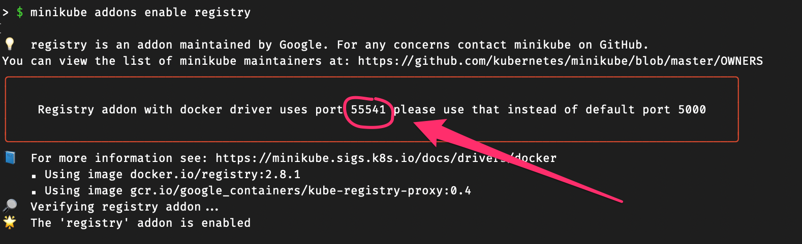

# Kubernetes, minikube

For development purposes, we use minikube to run a local Kubernetes cluster. This is the easiest way to get started with Kubernetes.

## Enabling Insecure Registries

If you are using a local registry, you need to enable insecure registries in minikube. This is required because the registry is not using TLS.

Start minikube with the following options:

* orbstack 

* minikube
```shell
minikube start --cpus 6 --memory 8g --insecure-registry "10.0.0.0/24"
```

## Registry

### Distribution

Docker Distribution is a storage and content delivery system that stores and distributes container images. It runs as a service on Linux and Windows operating systems.

```shell
docker run -d -p 5000:5000 --restart always --name registry distribution/distribution:edge
```

Accessible at http://http://registry.orb.local/v2/_catalog

### Harbor

Harbor is a cloud native registry that stores, signs, and scans container images for vulnerabilities. Harbor solves common challenges by delivering trust, compliance, performance, and interoperability. It fills a gap for organizations and applications that cannot use a public or cloud-based registry, or want a consistent experience across clouds.

https://goharbor.io/

```shell
helm repo add harbor https://helm.goharbor.io
```


##

```shell
minikube addons enable registry
```




Remember the port number, it will be used in the next step.


Bridge the registry to the host:

```shell
docker run --rm -it --network=host alpine ash -c "apk add socat && socat TCP-LISTEN:5000,reuseaddr,fork TCP:$(minikube ip):5000"
```

You can now push images to the registry and have access to the catalog:

```shell
curl localhost:55541/v2/_catalog
```


## Enabling volume with minikube multinode

```shell
minikube start --cpus 6 --memory 8g --insecure-registry "10.0.0.0/24" --nodes 4
```

```shell
minikube addons enable registry
minikube addons disable storage-provisioner
kubectl delete storageclass standard
```


```shell
kubectl apply -f k8s/kubevirt-hostpath-provisioner.yaml
```


For more information, see the minikube documentation:


https://minikube.sigs.k8s.io/docs/handbook/registry/#enabling-insecure-registries


Follow with the next step to install the [ArgoCD](argocd.md) operator.

## Appication priority

The application priority is used to determine the order in which applications may be OOMKilled by the Kubernetes scheduler.


* Guaranteed, won't be killed.
* Burstable, may be killed if really necessary.
* BestEffort, may be killed at any time.


## Developer experience 

* https://inlets.dev/blog/2022/06/24/fixing-kubectl-port-forward.html
